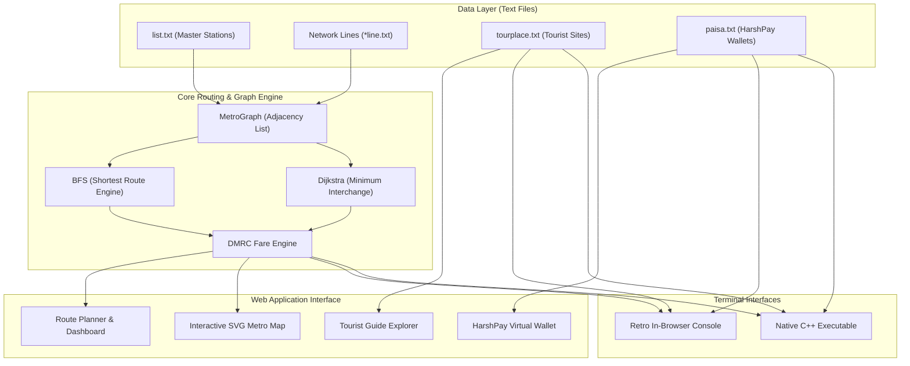

<div align="center">

# 🚇 Delhi Metro Route Finder
### *HKRC Classic Transit Edition • Graph Theory & Pathfinding System*

[](https://metro-route-finder-beige.vercel.app/)
[](https://github.com/Harshkumar2306/metro-route-finder-)
[](https://isocpp.org/)
[](https://developer.mozilla.org/)
[](https://html.spec.whatwg.org/)
[](https://www.w3.org/Style/CSS/)
[](https://opensource.org/licenses/MIT)

**[🌐 Experience the Live Web App](https://metro-route-finder-beige.vercel.app/)** • **[📂 View GitHub Source](https://github.com/Harshkumar2306/metro-route-finder-)**

---

</div>

## 📌 Table of Contents
- [📖 Overview](#-overview)
- [✨ Key Features](#-key-features)
- [🏗️ System Architecture](#️-system-architecture)
- [🧠 Graph Theory & Algorithms](#-graph-theory--algorithms)
- [📊 Feature Comparison: Web UI vs. C++ CLI](#-feature-comparison-web-ui-vs-c-cli)
- [🚀 Quick Start & Installation](#-quick-start--installation)
  - [1. Web Interface (Zero Dependencies)](#1-web-interface-zero-dependencies)
  - [2. Native C++ Core](#2-native-c-core)
- [📂 Project Directory Structure](#-project-directory-structure)
- [💳 HarshPay Transit Wallet Specification](#-harshpay-transit-wallet-specification)
- [👨‍💻 Author & Connect](#-author--connect)
- [📜 License](#-license)

---

## 📖 Overview

**Delhi Metro Route Finder** is a transit journey planner and network pathfinder for the Delhi Metro (HKRC/DMRC) system. 

Originally built as a foundational C++ data structures and algorithms project, it has been transformed into an interactive web application that preserves the retro charm of CLI tools while delivering a fixed-frame interactive dashboard with schematic SVG mapping, real-time fare calculations, tourist destination routing, virtual wallet simulations, and an in-browser console emulator.

---

## ✨ Key Features

### 🗺️ 1. Interactive Delhi Metro Schematic Map (SVG)
- **Comprehensive Network Coverage**: Visualizes active routes across the **Blue Line**, **Yellow Line**, **Red Line**, **Green Line**, **Violet Line**, and the high-speed **Airport Express Line**.
- **Vector Graphics & Viewport Control**: Features responsive SVG rendering, desktop zoom/reset controls, and mobile multi-touch pinch-to-zoom / drag-to-pan.
- **Interactive Stations**: Click station nodes directly on the canvas to set Origin/Destination or inspect line affiliations.
- **Dynamic Route Glow**: Highlights computed paths with glowing neon overlays and animated transit paths.

### 🧭 2. Smart Journey Pathfinder
- **Shortest Route (Time / Hops)**: Unweighted Breadth-First Search (BFS) finding optimal hops in $\mathcal{O}(V + E)$ time.
- **Minimum Interchanges Mode**: Weighted Dijkstra routing applying transfer penalties to minimize physical line transitions.
- **Step-by-Step Itinerary**: Boarding notifications, interchange stations, arrival station tracking, and cumulative travel time.

### 💰 3. Fare Calculation Engine
- Computes standard distance-slab token pricing.
- **HarshPay Card Benefit**: Automatic 10% discount on journeys.

### 🏛️ 4. Delhi Tourist & Heritage Guide (`tourplace.txt`)
- Explores 20+ historical monuments and tourist hotspots (India Gate, Red Fort, Qutub Minar, Akshardham, Lotus Temple, Connaught Place, Bangla Sahib, Rashtrapati Bhavan, etc.).
- 1-click **"Plan Route →"** shortcut to calculate directions directly to any landmark's nearest metro station.

### 📟 5. Retro C++ Terminal Console
- An authentic, in-browser CRT console simulator reproducing the exact command-line menu interface from the original C++ backend:
  1. Route between two stations
  2. Nearest metro station to tourist places
  3. HarshPay wallet recharge

---

## 🏗️ System Architecture



---

## 🧠 Graph Theory & Algorithms

The Delhi Metro rail network is modeled as an **undirected weighted graph** $G = (V, E)$:
- **Vertices ($V$)**: Metro stations ($|V| \approx 250+$ across all corridors).
- **Edges ($E$)**: Direct rail tracks between adjacent stations, tagged with line metadata (Color, Line Name).

### Algorithmic Breakdown:

| Metric | BFS (Shortest Distance) | Dijkstra (Minimum Interchanges) |
| :--- | :--- | :--- |
| **Primary Goal** | Minimize number of station hops / travel time | Minimize physical train changes (transfers) |
| **Edge Weights** | Uniform ($w = 1$) | Dynamic ($w = 1$ same line, $w = 10$ on line transfer) |
| **Time Complexity** | $\mathcal{O}(\|V\| + \|E\|)$ | $\mathcal{O}(\|E\| + \|V\| \log \|V\|)$ |
| **Space Complexity**| $\mathcal{O}(\|V\|)$ | $\mathcal{O}(\|V\|)$ |

---

## 📊 Feature Comparison: Web UI vs. C++ CLI

| Capability | Web Frontend (Vercel) | Native C++ CLI Core |
| :--- | :---: | :---: |
| **Pathfinding (BFS)** | ✅ | ✅ |
| **Interchange-Optimized Routing** | ✅ | ❌ |
| **Interactive Schematic Map** | ✅ (SVG Pan/Zoom) | ❌ |
| **Tourist Place Guide** | ✅ | ✅ |
| **HarshPay Wallet Recharge** | ✅ (Visual Card UI) | ✅ (CLI I/O) |
| **Retro CRT Console Mode** | ✅ (In-browser simulator) | ✅ (Native terminal) |
| **Device Adaptability** | ✅ (Mobile, Tablet, Desktop) | Terminal-only |

---

## 🚀 Quick Start & Installation

### 1. Web Interface (Zero Dependencies)
Deploy or run the lightweight static web interface with no npm packages or compilers required:

```bash
# Clone repository
git clone https://github.com/Harshkumar2306/metro-route-finder-.git
cd metro-route-finder-

# Start local server (Python 3)
python3 -m http.server 8080

# Or using Node npx
npx serve .
```
Access the application at `http://localhost:8080`.

---

### 2. Native C++ Core
Compile and execute the cross-platform C++ backend on macOS, Linux, or Windows:

```bash
# Using Makefile
make

# Or compile directly with clang++ / g++
clang++ -std=c++14 -O2 metro.cpp -o metro

# Run the binary
./metro
```

---

## 📂 Project Directory Structure

```text
metro-route-finder/
├── index.html           # Main application layout, SVG map canvas & Kiosk panes
├── style.css            # Dark classic transit theme, responsive flex frame, custom scrollbars
├── app.js               # Frontend controller, pan/zoom handlers, Web Audio API, terminal emulator
├── router.js            # MetroGraph class, BFS & Dijkstra pathfinders, Fare engine
├── data.js              # Station coordinates, route geometry, and landmark dataset
├── metro.cpp            # Original C++ source code with BFS graph routing
├── Makefile             # Multi-platform compilation recipe
├── list.txt             # Station catalog
├── blueline.txt         # Blue Line sequence (Dwarka 21 ↔ Noida City Centre)
├── bluext.txt           # Blue Line extension (Yamuna Bank ↔ Vaishali)
├── yellowline.txt       # Yellow Line sequence (Samaypur Badli ↔ HUDA City Centre)
├── redline.txt          # Red Line sequence (Rithala ↔ Dilshad Garden)
├── greenline.txt        # Green Line sequence (Inderlok/Kirti Nagar ↔ Brigadier Hoshiar Singh)
├── violetline.txt       # Violet Line sequence (Kashmere Gate ↔ Raja Nahar Singh)
├── orangeline.txt       # Airport Express sequence (New Delhi ↔ Dwarka Sector 21)
├── tourplace.txt        # Delhi monuments and tourist landmarks dataset
├── paisa.txt            # HarshPay card records database
└── README.md            # Project technical documentation & architecture
```

---

## 💳 HarshPay Transit Wallet Specification

The application integrates **HarshPay**, a simulated smart ticketing system:
- **Card Record Format** (`paisa.txt`): `<ID> <Balance>` (e.g. `100001 1000`)
- **Fare Discount**: Automatic 10% reduction applied to all calculated journey fares.
- **Top-up System**: Instant digital recharge with visual holographic card feedback and receipt confirmation.

---

## 👨‍💻 Author & Connect

**Harsh Kumar**
- **GitHub**: [@Harshkumar2306](https://github.com/Harshkumar2306)
- **Project Repo**: [metro-route-finder-](https://github.com/Harshkumar2306/metro-route-finder-)
- **Live Demo**: [https://metro-route-finder-beige.vercel.app/](https://metro-route-finder-beige.vercel.app/)

---

## 📜 License

This project is licensed under the [MIT License](LICENSE) — feel free to explore, learn, and build upon it!
